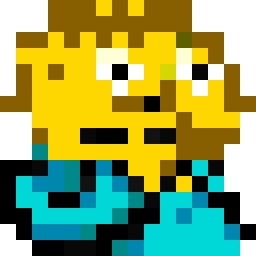

# ralph



AI-powered feature planner and builder. Ralph uses Claude to turn a feature description into a structured PRD through interactive Q&A, then implements each requirement iteratively — with Claude managing PRD updates, progress tracking, and git commits.

Inspired by [Adam Tuttle's](https://adamtuttle.codes) RALPH workflow for Claude Code.

## Prerequisites

- [Claude CLI](https://docs.anthropic.com/en/docs/claude-cli) installed and authenticated

## Installation

### Download a release (no Go required)

Download the latest binary for your platform from [GitHub Releases](https://github.com/sjhorn/ralph/releases), extract it, and add it to your PATH.

**macOS / Linux:**

```bash
# Set your platform: darwin_arm64, darwin_amd64, linux_amd64, linux_arm64
PLATFORM="darwin_arm64"

VERSION=$(curl -s https://api.github.com/repos/sjhorn/ralph/releases/latest | grep tag_name | cut -d'"' -f4 | sed 's/^v//')
curl -sL "https://github.com/sjhorn/ralph/releases/download/v${VERSION}/ralph_${VERSION}_${PLATFORM}.tar.gz" | tar xz
sudo mv ralph /usr/local/bin/
```

**Windows (PowerShell):**

```powershell
# Download the latest Windows release
$version = (Invoke-RestMethod "https://api.github.com/repos/sjhorn/ralph/releases/latest").tag_name -replace '^v',''
Invoke-WebRequest "https://github.com/sjhorn/ralph/releases/download/v$version/ralph_${version}_windows_amd64.zip" -OutFile ralph.zip
Expand-Archive ralph.zip -DestinationPath .
Move-Item ralph.exe "$env:LOCALAPPDATA\Microsoft\WindowsApps\"
Remove-Item ralph.zip
```

### Go install

```bash
go install github.com/sjhorn/ralph/cmd/ralph@latest
```

### Build from source

```bash
git clone https://github.com/sjhorn/ralph.git
cd ralph
make build
```

### Upgrading

The easiest way to update is the built-in command:

```bash
ralph update
```

This detects your platform, downloads the latest release, and replaces the current binary in-place.

**Alternative methods:**

```bash
# Go install
go install github.com/sjhorn/ralph/cmd/ralph@latest

# Build from source
cd ralph && git pull && make build
```

## Quick Start

The simplest way to use ralph is the guided mode — just run `ralph` with no arguments:

```bash
cd your-project
ralph
```

This walks you through the full workflow interactively:

1. Initializes `.ralph/` if needed
2. If an existing PRD has incomplete items, offers to **build**, **TDD build**, **add to plan**, **start fresh**, or **quit**
3. Asks for a feature description and runs Q&A with Claude to generate a PRD
4. Asks how many iterations to run (or type `tdd` to enter TDD mode)
5. Builds iteratively, showing progress after each iteration
6. Reports final status

## Commands

### `ralph` (guided mode)

```bash
ralph                          # interactive plan → build → status
ralph --claude-cmd claude-local  # use a different Claude CLI
```

### `ralph init`

```bash
ralph init
```

Scaffolds a `.ralph/` directory with:
- `config.json` — model, allowed tools, check commands, claude command
- `prd.json` — the requirements (starts empty)
- `progress.md` — append-only build log

### `ralph plan "description"`

```bash
ralph plan "add user authentication with OAuth"
```

Claude asks clarifying questions in rounds. Answer them, and when it has enough context it generates a structured PRD saved to `.ralph/prd.json`.

Running `plan` again loads the existing PRD so Claude can build on previous work.

Flags:
- `--model <model>` — override the configured Claude model
- `--claude-cmd <cmd>` — use a different Claude CLI
- `--max-rounds <n>` — max Q&A rounds (default: 10)
- `--output <path>` — PRD output path (default: `.ralph/prd.json`)

### `ralph build [N]`

```bash
ralph build      # run 1 iteration
ralph build 5    # run up to 5 iterations
```

Each iteration is a fresh Claude session that:
1. Reads the full PRD and progress log
2. Picks the highest-priority incomplete item
3. Implements it, reading existing code first
4. Updates `prd.json` (marks complete or leaves for next iteration)
5. Appends notes to `progress.md`
6. Makes a git commit

Stops early if all items are complete or Claude reports it's blocked.

Flags:
- `--model <model>` — override the configured Claude model
- `--claude-cmd <cmd>` — use a different Claude CLI
- `--tdd` — enable TDD gated workflow (see below)
- `--retries <n>` — max retries per TDD phase (default: 3)

### TDD Mode

```bash
ralph build --tdd 3        # TDD gated build, 3 iterations
ralph build --tdd --retries 5 1  # TDD with 5 retries per phase
```

TDD mode adds mechanical verification to each build iteration. Instead of trusting Claude to self-report, ralph gates each step with real test execution:

```
For each PRD item:
  1. Claude writes failing tests for the item
  2. Gate: ralph runs test_command, expects failure (TDD Red)
  3. Claude implements the feature
  4. Gate: ralph runs test_command, expects success (TDD Green)
  5. Gate: ralph runs each check_command (lint, vet, etc.)
```

If a gate fails, Claude retries with the gate output as feedback. After `--retries` exhausted:
- **Headless** (`ralph build --tdd`): halts with non-zero exit
- **Guided** (`ralph` → tdd): prompts to skip, retry, or quit

**Auto-detection**: If `test_command` is not set in config, ralph uses Claude to analyze the project and suggest the right command. In headless mode, the suggestion is auto-accepted; in guided mode, you can accept, edit, or reject it.

TDD mode is also available in guided mode — type `tdd` at the iteration prompt.

### `ralph status`

```bash
ralph status
```

Shows which PRD items are complete and which remain.

### `ralph update`

```bash
ralph update
```

Self-updates ralph to the latest GitHub release. Detects your OS and architecture, downloads the matching binary, and replaces the current one in-place. Refuses to run on `dev` builds (use `go install` or rebuild from source instead).

## Configuration

### `.ralph/config.json`

```json
{
  "model": "sonnet",
  "allowed_tools": ["Read", "Edit", "Write", "Bash"],
  "check_commands": ["go vet ./..."],
  "test_command": "go test ./...",
  "claude_command": "claude"
}
```

| Field | Description | Default |
|-------|-------------|---------|
| `model` | Claude model to use | `sonnet` |
| `allowed_tools` | Tools Claude can use during build | `Read, Edit, Write, Bash` |
| `check_commands` | Shell commands to verify work (lint, vet, etc.) | `[]` |
| `test_command` | Test command for TDD mode gates | `""` (auto-detected) |
| `claude_command` | CLI binary to invoke | `claude` |

The `--claude-cmd` flag overrides `claude_command` for a single run, useful for testing with local models or alternative CLI wrappers.

### `.ralph/` directory

| File | Purpose |
|------|---------|
| `config.json` | Model, tools, check commands, CLI command |
| `prd.json` | The PRD — array of requirements with pass/fail status |
| `progress.md` | Append-only log written by Claude each iteration |

## How It Works

Ralph implements the [RALPH workflow](docs/adam-tuttle-ralph-workflow.md) as a Go CLI:

1. **Plan** — You describe a feature. Claude asks clarifying questions, then generates a structured PRD with categorized requirements and implementation steps.

2. **Build** — Each iteration gives Claude the full PRD and progress log. Claude picks the highest-priority incomplete item, implements it, updates the PRD, logs progress, and commits. If an item is too complex for one iteration, Claude can leave it incomplete for the next iteration to pick up.

3. **Track** — `prd.json` tracks what's done. `progress.md` serves as institutional memory between iterations. Git commits create a reviewable history.

## License

[MIT](LICENSE)
